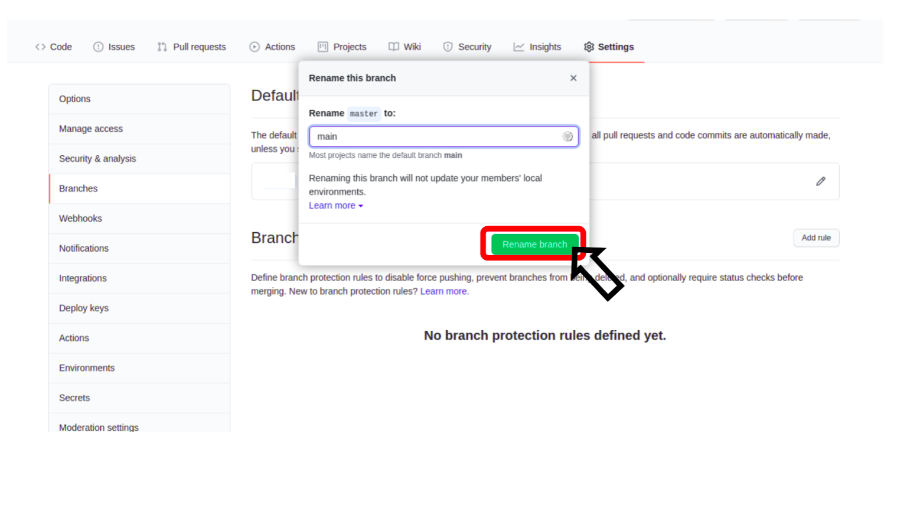

# How-2-Rename-Default-Branch-2-main
It's description of How to rename from old default branch name to "main"

## STEP1

## STEP2

## STEP3

## STEP4

## STEP5

## STEP6

## If you have a local clone, you can pudate it by it running
~~~
git branch -m <Old branch name> main
git fetch origin
git branch -u origin/main main
~~~
